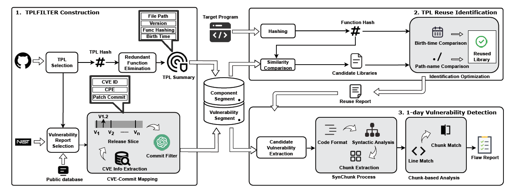

## VULTURE

VULTURE is designed to detect 1-day vulnerabilities arise from vulnerable TPL reuses. 

Dataset is available at: https://zenodo.org/records/13824990

It is constructed of three modules: ***TPLFILTER Construction*, *TPL Reuse Identification* and *1-day Vulnerability Detection*.** Each realized in a directory with the corresponding name.




#### Environment

The pip environment requirements are provided with `requirments.txt`, you can run the following command:

 `pip install -r requirements.txt`.

Other tools required:

```
sudo apt install clang-format
```

and install *ctags* [here](https://github.com/universal-ctags/ctags).

#### Steps

##### TPLFilter Construction

TPL construction is developed based on [Centris](https://github.com/WOOSEUNGHOON/Centris-public?tab=readme-ov-file#software). You can select your target platform and utilize TPLFilter for building a database that includes TPL function hashing, versions, related CVEs, and corresponding patches. For this example, we focus on the IoT platform.

###### Collect keywords list related to your target platform & exclude unwanted repos:

1. You can initially collect all of the repos on GitHub with specific languages by running:

   ```shell
   cd TPLselection
   python3 git_all_spider.py C cpp --stars 100 500
   ```

   **Languages**: Specify the target languages as arguments. In the example above, `C` and `cpp` are used.

   **Star Range**: Use the `--stars` option followed by two numbers to set the minimum and maximum star count for the repositories you want to collect. In the example, repositories with 100 to 500 stars are targeted.

2. Then you can filter out and exclude unwanted TPL by keywords matching, an example of keywords is in `TPLFilter/src/TPLselection/keywordsList`


###### Collect TPLs & generate code hashing

1. Put the urls you collect above into `TPLFilter/src/osscollector/targetTPLs`
2. `cd ../osscollector `and run `python3 OSS_Collector.py` to collect TPLs. You can run it with single process or using multiprocessing .
3. Then `cd ../preprocessor` and run `python3 Preprocessor_lite.py` for redundant elimination.


###### Vulnerability & Patch collection

Please refer to [THIS](TPLFilter/src/patchcollector/README.md) for more information

An example is added [HERE](TPLFilter/src/patchcollector/example.pdf)

##### TPL Reuse detection

1. You can now `cd ../TPLReuseDetector` and run `python3 Detector.py /path/of/the/target/software`. The reused TPLs and their version can be found at `res/result_your_software_name`
2. Then you can run `python3 fp_eliminator.py res/result__your_software_name` to eliminate false positive. The final result can be found at `modified_result_without_funcyour_software_name`


##### 1-day Vulnerability Detection

Just run `python3 VersionBasedDetection.py /path/of/the/target/software`  you'll get the result directly

The result will show which CVE might affect your software and what you have patched like the following

```
Vulnerable CVEs Exact: set('freetype_freetype/CVE-2014-9666')
Vulnerable CVEs Modified: set('curl_curl/CVE-2023-28322')
Patched CVEs Exact: set('freetype_freetype/CVE-2014-9660')
Patched CVEs Modified: set('curl_curl/CVE-2022-27781')
Version Detection: set('curl_curl/CVE-2016-0754', 'freetype_freetype/CVE-2017-8287', 'mbed-tls_mbedtls/CVE-2020-36477', 'freetype_freetype/CVE-2010-3311')
```


